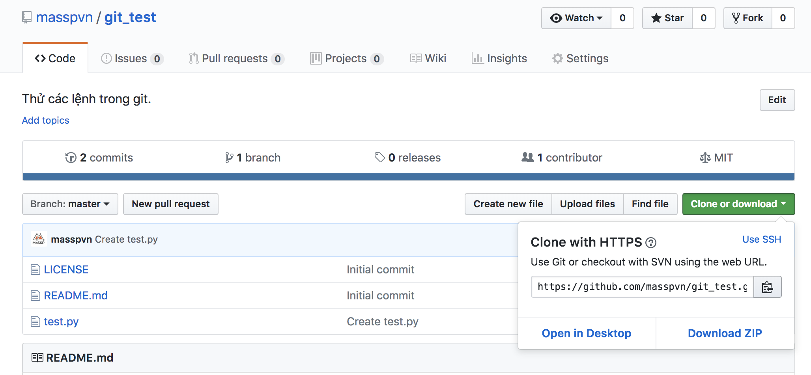

Các bạn hãy làm theo các chỉ dẫn sau đây. Như thường lệ, hãy post lên group MaSSP môn Tin nếu tìm ra lỗi sai hay có thắc mắc!

# 1. Tải repo hiện tại về máy
- Từ terminal, dùng lệnh `git clone https://github.com/masspvn/git_test.git` để tải repo này về máy. Đường dẫn "https://github.com/masspvn/git_test.git" có thể được tìm thấy ở trang chủ của repo

- Xem lịch sử của repo trên máy tính với lệnh `git log`
- Chọn một file bất kì, dùng lệnh `git blame tên_file` để thấy tác giả và thời điểm thay đổi của từng dòng code trong file
- Dùng lệnh `git status` để thấy trạng thái của repo trên máy

# 2. Thực hiện các thay đổi trên một nhánh
## 2.1. Thực hiện các thay đổi trên máy tính
Các bước sau được thực hiện trong thư mục `exercise_1`. Các bạn sẽ tạo ra một thay đổi trên một nhánh có tên `exercise_1_TênCủaBạn_branch`. Để thay đổi này được quyền xuất hiện trên repo, bạn hãy cho nhóm mentors của MaSSP biết Github username của bạn.
- Hãy tạo một nhánh mới có tên `exercise_1_TênCủaBạn_branch`
- Dùng lệnh `git status` và `git branch` để thấy trạng thái của repo trên máy. Đầu ra có phù hợp với dự đoán của bạn không?
- Copy file `exercise_1_template.py` thành một file khác có tên `exercise_1_TênCủaBạn.py`, bằng cách sử dụng các lệnh Linux CLI đã học
- Dùng lệnh `git status` để thấy trạng thái của repo trên máy. Đầu ra có phù hợp với dự đoán của bạn không?
- Hoàn thành các checkpoints trong file `exercise_1_TênCủaBạn.py`, sẽ mất khoảng 30 phút
- Dùng lệnh `git add exercise_1_TênCủaBạn.py` để đưa file này vào trạng thái chuẩn bị được commit (staging area)
- Dùng lệnh `git status` để thấy trạng thái của repo trên máy. Đầu ra có phù hợp với dự đoán của bạn không?
- Dùng lệnh `git commit -m "Nội dung bạn tự chọn"` để tạo một commit, lưu lại thay đổi này vĩnh viễn trên máy bạn
- Dùng lệnh `git status` và `git log` để thấy trạng thái của repo trên máy. Đầu ra có phù hợp với dự đoán của bạn không?
## 2.2. Đưa commit lên repo chung
Bước này đòi hỏi các bạn có quyền collaborator trong repo này. Hãy cho nhóm mentors của MaSSP biết Github username của bạn để có quyền đưa thay đổi của bạn lên repo chung.
- Vẫn tại nhánh `exercise_1_TênCủaBạn_branch`, dùng lệnh `git push origin exercise_1_TênCủaBạn_branch` để nhánh này được xuất hiện trên repo

Các bạn hãy nhớ lại từ bài giảng, sau bước trên, thay đổi của bạn chưa được nhập vào master mà vẫn ở một nhánh riêng biệt. Để nhập 2 nhánh này lại, các bạn nên tạo một `pull request`, cơ bản là để có ít nhất một thành viên khác xem những thay đổi của bạn có phù hợp không. Khi thành viên đó chấp nhận yêu cầu được nhập vào master của bạn, bạn mới nên nhập thay đổi vào master.
- Từ trang https://github.com/masspvn/git_test, nhấn vào tab "??? branches" ở giữa "??? commits" và "??? releases". Tại đây bạn sẽ thấy nhánh `exercise_1_TênCủaBạn_branch`. Hãy nhấn vào nút "New pull request", và điền thông tin tóm tắt lại những thay đổi của bạn trong nhánh này. Nhấn "Create pull request" sau khi hoàn thành
- Bạn nên đợi có người "review" thay đổi của bạn trước khi nhập thay đổi vào master. Bạn sẽ nhận được email thông báo hoặc notification trên trang Github khi có người chấp nhận thay đổi này. Lúc này, từ trang pull request, bạn có thể nhấn nút "Merge pull request" rồi "Confirm merge" để chính thức nhập những thay đổi trong nhánh này vào master
- Quay trở lại terminal trên máy tính. Dùng lệnh `git checkout master` để quay lại nhánh master. Dùng lệnh `git status` để chắc chắn rằng không có thay đổi nào chưa được commit tại đây
- Dùng lệnh `git pull` để tải những thay đổi mới về máy của bạn. Lúc này, lệnh `git log` chắc chắn sẽ cho thấy commit của bạn

Kết thúc bài tập về Git!